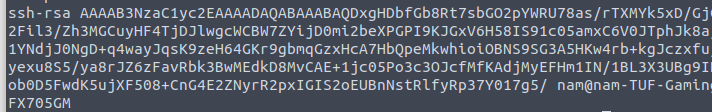
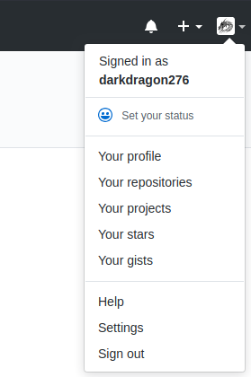
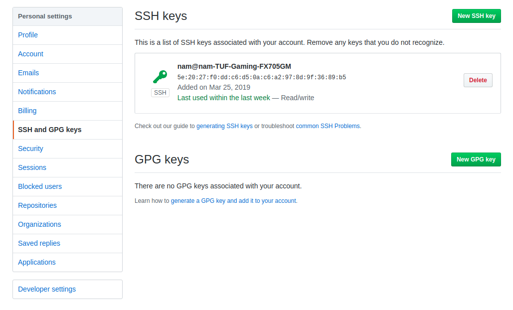
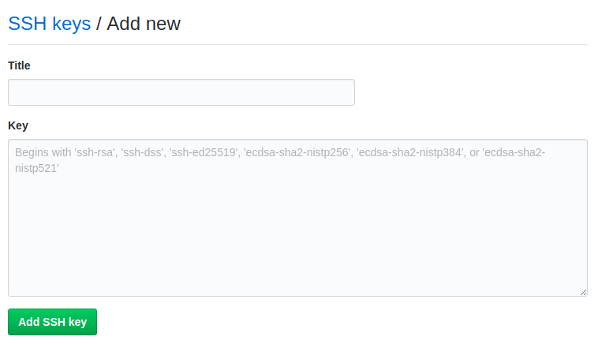

# Init_your_Git
Some necessary init your Git

## Add SSH key 
1. Get SSH key from local
```
$ sudo apt-get install openssh-client
$ ssh-keygen // enter 2 times
$ cat ~/.ssh/id_rsa.pub
```  
  
2. Coppy SSH key to your setting  
- Open Your "setting" below your avartar on the top left of the site  
  
- Open "SSH key and GPGs key"  
- Click "New SSH key"  
  
- Coppy your key to the box
  
- Click "Add SSH key"  

Done

## Save your username and password

```
$ git config credential.helper store
$ git push origin master
Username for 'https://github.com': <your-username  
Password for 'https://darkdragon276@github.com': <your-password  
$ git pull  // for new password and user name
```
## Config bash for virtualenv python3
```
function env(){
    case "$1" in
        #new enviroment
        -n) 
            if [ -z $2  ]
                then
                echo "Please input env file name"
                return
            fi
            virtualenv -p python3 "$2"
        ;;
        #active enviroment
        -a)
            if [ -d $2/bin/activate ]
                then
                source $2/bin/activate
            else
                echo "Invalid file name"
            fi
        ;;
        #deactive enviroment
        -d)
            deactivate
        ;;
        #remove enviroment folder
        -r)
            if [ -d $2 ]
                then
                rm -rf $2
            else
                echo "Invalid file name"
            fi
        ;;
        #backup enviroment package
        -b)
            pip freeze > requirements.txt
        ;;
        
        *) echo "Invalid Option"
        ;;
    esac
}
```
